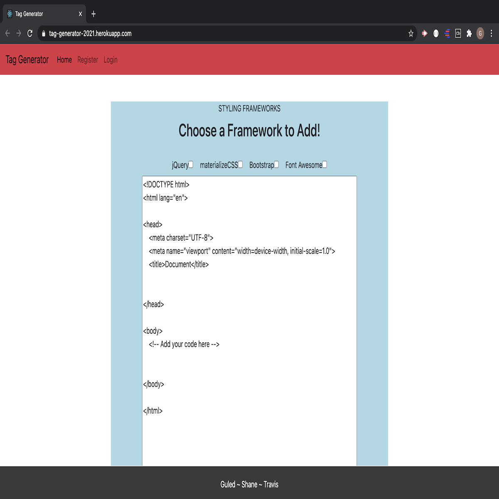

# Tag Generator (Final Project/Project 3)

## Description:

This application allows the user to generate an HTML script that contains the user's selected preferences from a list of framework. The user of this application will have to sign up to create an account. Once the user has an account, then the user can select a framework from a list of frameworks. The framework selected will be generated in the form of a script and it will be attached/added to the HTML script tag. The user then can save the script tag that was generated onto his account. 

 

# Usage:

This application was designed to assist Web Developers and Software Engineers who want to save time by generating an HTML containing their desired script with the click of a button.

 

# Authors:

### Shane O'Connell: https://github.com/shaneocon

### Travis Ko: https://github.com/TechKoSpeaks

### Guled Ahmed: https://github.com/Guled06

 

# Credit:

### UCSD Trilogy Coding Bootcamp

 

# Technologies Used:

* [Mongo](www.npmjs.com/package/mongodb) - Used for Database.
* [Express](https://www.npmjs.com/package/express) - Used for routes and handling requests.
* [React](https://github.com/reactjs/reactjs.org) - Framework that was used.
* [Node](https://www.npmjs.com/package/node) - Used for developing server-side and networking functionality.
* [React-Bootstrap](https://react-bootstrap.github.io/) - Used to generate front end styling
* [Axios](https://www.npmjs.com/package/axios) - Used for the API requests.
* [Heroku](https://devcenter.heroku.com/categories/reference) - Used to deploy the App
* [JWT](https://jwt.io/) - Used for Node.js Authentication

 

# Deployment:

GitHub Repository Link: https://github.com/shaneocon/tag-generator

Heroku Link: https://tag-generator-2021.herokuapp.com/

 

# ScreenShot Picture:

